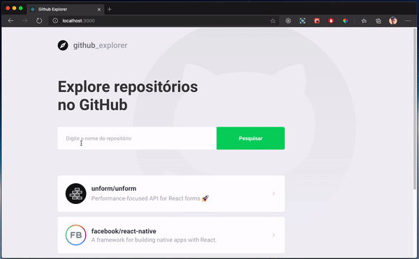

<p align="center">
  <a href="" rel="noopener">
  </a>
</p>

<h3 align="center">Ferramenta para exploração de repositórios do GitHub. Desenvolvido com ReactJS | TypeScript | Styled Components</h3>

---

<a align="center">

</a>

## 📝 Conteúdo

- [Sobre](#about)
- [Iniciando](#getting_started)
- [Techs utilizadas](#built_using)
- [Autor](#authors)
- [Agradecimentos](#acknowledgement)

## 🧐 Sobre o projeto <a name = "about"></a>

Sistema (SPA) criado com ReactJS e TypeScript para exploração de repositórios GitHub. Este projeto permite salvar e listar repositórios e oferece uma maneira fácil de acessar a página de detalhes do repositório.

Foi construído como um exercício do GoStack Bootcamp da Rocketseat para colocar em prática os estudos de ReactJS, React Hooks, Styled Components, React Router Dom.

Este projeto se conecta à API oficial do GitHub para obter os dados.


## 🏁 Iniciando <a name = "getting_started"></a>

Essas instruções fornecerão uma cópia do projeto instalado e funcionando em sua máquina local para fins de desenvolvimento e teste.

### Pré requisitos

Tudo o que você precisa para instalar o software:

**NodeJS** <br>
[NodeJS](https://nodejs.org/en/)

**Um gerenciador de pacotes como NPM ou Yarn** <br>
[Node.js](https://nodejs.org/en/)
[Yarn](https://yarnpkg.com/pt-BR/docs/install)

**Git instalado em sua máquina (Mac e Linux já vem instalado)** <br>
[Download Git para seu SO](https://git-scm.com/downloads)

### Instalação

#### modo de desenvolvimento ( rodando localmente )

```shell
# abra seu terminal/cmd e realize o clone do repositório
git clone https://github.com/lucasbarque/github_explorer.git

# vá até a pasta github-explorer
cd github_explorer

# realize a instação de todas as dependências
yarn
# ou utilizando o NPM
npm install

# rode o app com o comando
yarn start
#ou com o NPM
npm run start

# Pronto o app estará disponível no endereço "http://localhost:3000" 🎉🎉🎉

```

## ⛏️ Tecnologias utilizadas <a name = "built_using"></a>

- [ReactJS](https://www.google.com/url?sa=t&rct=j&q=&esrc=s&source=web&cd=1&cad=rja&uact=8&ved=2ahUKEwie4-3NjZPpAhU7EbkGHRGZBoQQFjAAegQIExAC&url=https%3A%2F%2Fpt-br.reactjs.org%2F&usg=AOvVaw3IQxnDAV4OTuyk7FEN--qA)
- [TypeScript](https://www.google.com/url?sa=t&rct=j&q=&esrc=s&source=web&cd=1&cad=rja&uact=8&ved=2ahUKEwi02eObjpPpAhVPIrkGHWAyAycQFjAAegQIARAB&url=https%3A%2F%2Fwww.typescriptlang.org%2F&usg=AOvVaw0CNxTP-CKE5ss0r3aWazpG)
- [Styled Components](https://www.google.com/url?sa=t&rct=j&q=&esrc=s&source=web&cd=1&cad=rja&uact=8&ved=2ahUKEwj5n6jJjZPpAhV6LLkGHed1B80QFjAAegQIBxAC&url=https%3A%2F%2Fwww.styled-components.com%2F&usg=AOvVaw0J6heqwwkbKYNkr_2e7jIU)
- [Axios](https://www.google.com/url?sa=t&rct=j&q=&esrc=s&source=web&cd=1&cad=rja&uact=8&ved=2ahUKEwjcm422jZPpAhXlH7kGHYk4AK8QFjAAegQIAxAB&url=https%3A%2F%2Fgithub.com%2Faxios%2Faxios&usg=AOvVaw266wVW3XPRY46nOw2ULXdh)
- [React Router DOM](https://www.google.com/url?sa=t&rct=j&q=&esrc=s&source=web&cd=1&cad=rja&uact=8&ved=2ahUKEwjEvujUjZPpAhVJIbkGHaNUDdEQFjAAegQIAhAB&url=https%3A%2F%2Freacttraining.com%2Freact-router%2Fweb&usg=AOvVaw39MVbEMEQCl6DDWEkh8tYs)
- [React Icons](https://www.google.com/url?sa=t&rct=j&q=&esrc=s&source=web&cd=1&cad=rja&uact=8&ved=2ahUKEwiW56XrjZPpAhUiHbkGHUrjDCMQFjAAegQIARAB&url=https%3A%2F%2Freact-icons.github.io%2Freact-icons%2F&usg=AOvVaw2p26skb8fJ07Tiqs_rtKvr)

## ✍️ Authors <a name = "authors"></a>

- [@lucasbarque](https://github.com/lucasbarque/)
- Sinta-se à vontade para dar feedbacks [Linkedin](https://www.linkedin.com/in/lucas-barque/)

## 🎉 Agradecimentos <a name = "acknowledgement"></a>

- [Time da Rocketseat](https://rocketseat.com.br/)
- [Diego Fernandes, CTO na Rocketseat](https://github.com/diego3g)